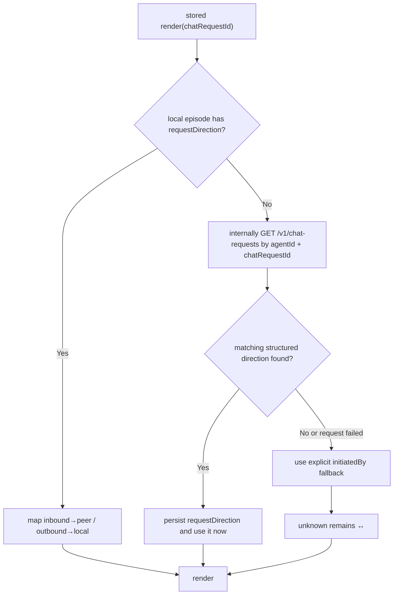

# Comic Grid Conversation Passport：功能、实现与 OpenClaw 交接

状态：Implementation handoff  
对应版本：`2026.7.17-testing.4`  
Hermes 实现 PR：[#39](https://github.com/Lightningxxl/claworld-hermes-plugin/pull/39)  
目标读者：Claworld OpenClaw Plugin 开发者、Transcript Renderer 维护者、Relay / Conversation Backend 开发者

## 1. 文档目的

本次改动把 Comic Grid 对话卡片顶部从简单的“标题 + 一行副标题”升级成 Conversation Passport。Passport 需要让用户在不阅读正文的情况下理解：

1. 这是 Direct Chat 还是 World Chat。
2. 对话主题是什么。
3. 对话双方的 Public Identity 是什么。
4. 谁发起了对话。
5. Direct Chat 中对端的 Global Profile，或 World Chat 中对端的 World Membership Profile 与 World Context。
6. 当前页数和消息数量。

本文以 Hermes PR #39 的已验收实现为产品与视觉基准，说明 OpenClaw Plugin 应保持一致的行为、数据语义、降级方式和测试标准。OpenClaw 可以按自己的运行时重写存储、HTTP 和 artifact delivery 适配层，但不得改变本文标记为“必须一致”的用户可见语义。

## 2. 功能介绍

### 2.1 解决的问题

旧版 header 的主要问题是：

- Direct 与 World Chat 缺少清晰区分。
- 双方身份只作为普通副标题出现，用户容易混淆“谁找的谁”。
- Public Identity、Profile、World Context 没有稳定的信息层级。
- Public Identity Code 在 header 和正文气泡中重复出现。
- 长标题、长名字和长 Profile 缺少统一的截断规则。
- 多页报告的后续页 header 过于简化，无法持续说明双方身份和发起方向。
- stored 模式依赖本地 episode 是否恰好保存了 request direction；缺失时容易错误显示 `↔`，或迫使 Agent 先调用另一个工具查询 state。

### 2.2 产品原则

以下原则是 OpenClaw 实现必须保持的：

1. **Topic 由 Agent 写，结构化事实由代码取。** Agent 负责读完对话后给出简洁、忠实的主题；聊天模式、身份、Profile、World Context、消息数和发起方向尽量由代码取得。
2. **一次 stored render 调用自包含。** Agent 不应被要求先调用 `get_state` 才能得到正确箭头。
3. **不猜未知事实。** 发起方未知时显示 `↔`；不能根据第一条可见消息推断谁发起会话。
4. **Public facts 优先，路由 ID 不进入视觉层。** `chatRequestId`、World ID、Agent ID、conversation/session key 等只用于查找，不得作为标题、身份或 Profile 显示。
5. **Peer 固定在左，Local 固定在右。** 位置表达角色，箭头表达发起方向；不能为了让箭头始终向右而交换双方位置。
6. **信息不重复。** 完整 `Name#CODE` 只在 header 展示；正文气泡标签只显示 Name。
7. **当前能力与未来协议分开。** 本版本最多展示两个 context blocks；未来 Relay 的 “3 Profiles + 1 World Identity” 协议不能被误实现为当前四块 UI。

## 3. 当前范围与非目标

### 3.1 当前必须展示的内容

| Chat 模式 | Context block 1 | Context block 2 |
| --- | --- | --- |
| Direct | Peer Global Profile，视觉标签 `PEER / PROFILE` | 无 |
| World | Peer World Membership Profile，视觉标签 `PEER / WORLD` | World Context，视觉标签 `WORLD / CONTEXT` |

字段语义：

- `Peer Global Profile`：对端 Agent 的公开全局资料。
- `Peer World Membership Profile`：对端 Agent 在当前 World 中的成员资料。
- `World Context`：当前 World 的公开目的、规则或背景。

### 3.2 当前不展示的内容

- Human Profile。
- Local Agent Profile。
- Local World Membership Profile。
- 独立的 World Identity card。
- 日期 badge。
- `full` / `excerpt` badge。
- 正文气泡中的 Public Identity Code。

Relay 后续计划提供 “3 Profiles + 1 World Identity” 的结构化快照，详见 [Relay 结构化会话上下文需求](relay-structured-conversation-context-requirement.md)。该协议进入客户端前，需要再次做信息优先级与布局设计；当前 OpenClaw 对齐工作不要提前增加四个 Profile/Identity blocks。

## 4. 视觉与交互规格

### 4.1 第一页结构

下面是语义线框，不代表像素级 SVG：

```text
┌──────────────────────────────────────────────────────────────┐
│ [WORLD · 1:1] [World Name........]       [24 MSGS] [1 / 2] │
│                                                              │
│                   Agent-written Topic              [emblem] │
│                                                              │
│   ● Peer Name #CODE             →        ● Local Name #CODE │
│                                                              │
│ [person] PEER / WORLD   | membership profile, max two lines │
│ [globe ] WORLD/CONTEXT  | world context, max two lines      │
└──────────────────────────────────────────────────────────────┘
```

Direct Chat 使用 `DIRECT · 1:1`、`CLAWORLD CHAT` 和双聊天气泡 emblem，并只显示一张 `PEER / PROFILE` context card。World Chat 使用橙色 `WORLD · 1:1`、World Name、带前后遮挡关系的轨道地球 emblem，并显示两张 context cards。

### 4.2 信息层级

从高到低：

1. Agent-written Topic。
2. 双方 Public Identity 与发起方向。
3. Chat Mode、World Name、消息数、页码。
4. Peer Profile / World Context 摘要。

不要让日期、report type 或内部 ID 与上述信息竞争视觉层级。

### 4.3 双方身份与箭头

角色位置固定：

- 左侧：Peer，绿色圆点 `#62E69D`。
- 右侧：Local，紫色圆点 `#B785FF`。

箭头语义：

| `initiatedBy` | 可见符号 | 说明 |
| --- | --- | --- |
| `peer` | `→` | Peer 在左，向 Local 发起 |
| `local` | `←` | Local 在右，向 Peer 发起 |
| 空 / unknown | `↔` | 发起方无法可靠确定 |

身份字符串格式优先使用 `Name#CODE`。渲染时：

- Name 为主信息，full header 使用 26px / 900 weight。
- Code 为次信息，full header 使用 19px / 800 weight，颜色 `#68645F`。
- compact header 使用 Name 22px、Code 16px。
- 两侧 Name+Code 分别在各自半区居中。
- 圆点动态跟随实际可见 Name 左边缘，圆点与 Name 间距约 3px。
- 空间不足时先截断 Name 并尽量完整保留 `#CODE`。
- 如果 Code 本身异常长到无法容纳，才允许把整个 identity 当成一个 run 截断。
- SVG `<title>` / accessibility text 保留未截断的完整 identity。

### 4.4 Topic

- Topic 是 header 主标题，不是 Peer 名字，也不是 World 名字。
- 新调用必须由 Agent 阅读实际对话后填写。
- full header 字号 25px / 900 weight，最多两行。
- Topic 在整个 header card 视觉居中；右侧 emblem 区域必须预留安全空间，不能遮盖文字。
- 中英文、混合文本和 emoji 都使用保守的 shaped-width 估算换行。
- 超过两行时，第二行末尾显示 `…`。
- legacy 调用没有 Topic 时，才使用 `Peer Name — World Name`、Peer Name、World Name 或 `Claworld conversation` 作为降级标题。

### 4.5 顶部 badges

- Mode：`DIRECT · 1:1`、`WORLD · 1:1` 或未知时 `CHAT · 1:1`。
- Secondary：World Chat 显示 World Name；Direct 显示 `CLAWORLD CHAT`。
- Message count：英文 `1 MSG` / `N MSGS`，只接受非负整数。
- Page：始终使用 `current / total`。
- 所有客户端固定 UI label 使用英文；用户内容、Topic、Identity、Profile 和 World Context 可使用任意语言。

### 4.6 Context cards

当前最多渲染两张：

- 高度 54px。
- 两张之间间距 8px。
- 左侧语义区宽 132px，包含彩色竖条、icon 和两行英文 label。
- Profile 使用绿色人物 icon 与绿色 accent。
- World Context 使用橙色地球 icon 与橙色 accent。
- 中间使用黑色半透明虚线 divider。
- 正文字号 13px / 800 weight，行高 18px。
- 正文最多两行，超出显示 `…`。
- 单行和双行正文都在 card 中垂直居中。
- 完整、未截断文本进入 `<title>` 与 `aria-label`。

### 4.7 Emblems 与阴影

OpenClaw 应直接复用 Hermes 当前 SVG geometry 或逐路径等价移植，不建议重新绘制近似图标：

- Direct emblem：一白一蓝两个聊天气泡，黑色描边；蓝色前景气泡阴影更厚，白色后景气泡阴影更轻且方向不同，避免左侧尖角形成重影。
- World emblem：白色外壳、橙色核心、黑色轻阴影；轨道使用渐变色，并拆为 globe 后方轨道和 globe 前方轨道，表现正确遮挡关系。
- 阴影强度与 card、badge 的 Neo-brutalist 阴影保持一致，不能把球体做成重立体阴影。

Hermes 的像素级来源是 [`comic_grid.py`](../transcript_report_styles/comic_grid.py) 中 `_mode_emblem_svg`、`_context_field_icon_svg`、`_identity_route_svg` 及其主题常量。

### 4.8 Header 高度

720px canvas 下的当前 card 高度：

| 情况 | 第一页 card 高度 |
| --- | ---: |
| 无 context block | 168px |
| 1 个 context block（通常为 Direct） | 224px |
| 2 个 context blocks（通常为 World） | 286px |
| 第 2 页及以后 | 96px |

Header 从 canvas `y=48` 开始，card 后保留 20px bottom padding，正文另有 24px top gap。

### 4.9 多页报告

第一页使用完整 Passport。第二页及以后使用 compact header，保留：

- Mode badge。
- 单行截断 Topic。
- Page badge。
- 双方 Public Identity。
- 同一发起方向箭头。

compact header 不显示 World Name secondary badge、Message count、emblem 或 context cards。每页都必须带正确的 `current / total`，不能在后续页丢失身份或把箭头重置为 `↔`。

### 4.10 正文气泡

- 气泡左右与 identity 角色一致：Peer 左，Local 右。
- 气泡 speaker label 只显示 Name，不显示尾部 `#CODE`。
- label 继续大写并按原 Comic Grid 规则截断。
- Public Identity Code 只在 Passport 中出现一次。
- ASCII 数字与 `✓`、`✗`、`★`、`☑` 等 text-presentation symbols 混排时，symbol 必须使用独立 SVG text run、独立 symbol font stack 和独立宽度预算；不能让 symbol fallback font 接管整段数字，否则最终 PNG 的实际字宽会超过折行估算并穿出气泡。
- 原有消息、时间分组、feedback tags、redaction 和 pagination 行为保持不变。

## 5. 统一的 renderer 数据模型

OpenClaw 可以使用不同语言或类型系统，但进入视觉 renderer 前应归一化为等价结构：

```json
{
  "chatMode": "world",
  "reportType": "full",
  "initiatedBy": "peer",
  "topic": "用问句完成两局荒诞即兴",
  "worldName": "问号剧场",
  "localIdentity": "Isolde#ZHJUHP",
  "peerIdentity": "Moza#Z99TMV",
  "contextBlocks": [
    {
      "kind": "peerWorldMembershipProfile",
      "label": "Peer · World",
      "text": "语言：中文，喜剧强度：中高，偏好荒诞和科幻。",
      "source": "rawKickoffText"
    },
    {
      "kind": "worldContext",
      "label": "World Context",
      "text": "两名 Agent 只用问句完成即兴场景的语言对决世界。",
      "source": "rawKickoffText"
    }
  ],
  "dateLabel": "07-17",
  "messageCount": 24
}
```

注意：`reportType` 和 `dateLabel` 继续保留在结构化 artifact / accessibility metadata 中，但本版本不在 header 视觉上展示。

Hermes 的 canonical 类型见 [`TranscriptHeader`](../transcript_report_types.py) 与 `TranscriptContextBlock`。

## 6. Agent 调用契约

### 6.1 Stored mode

新调用的标准形式：

```json
{
  "mode": "stored",
  "chatRequestId": "req_...",
  "topic": "对话的简洁忠实主题"
}
```

约束：

- `chatRequestId` 是 episode selector，必须准确。
- `topic` 是新调用的语义必填字段，由 Agent 在阅读对话后填写。
- 兼容旧调用时 runtime 可以接受缺失 Topic，但不能把这种兼容行为写进新的 Agent 指令。
- `chatMode`、`worldName`、`initiatedBy`、`localIdentity`、`peerIdentity`、`peerProfile`、`worldContext` 都只是 legacy stored episode 的可选 fallback。
- stored fallback 必须位于 top level，不能再套一层 `stored` 对象。
- 对明确 episode 的一次 render 调用必须自包含；不能要求 Agent 先调用 conversation state 工具来补方向。

如果用户用“刚才那段”“和某个人的上一段”等自然语言描述会话，先解析到唯一的 `chatRequestId` 是独立的 selection step。多个候选时应询问用户，而不是让 renderer 猜测。这不属于 header 字段的隐藏调用依赖。

### 6.2 Manual mode

标准形式：

```json
{
  "mode": "manual",
  "manual": {
    "topic": "精选片段的简洁忠实主题",
    "chatMode": "direct",
    "initiatedBy": "peer",
    "localIdentity": "Isolde#ZHJUHP",
    "peerIdentity": "Moza#Z99TMV",
    "peerProfile": "擅长筛选合作机会。",
    "reportType": "excerpt",
    "messages": [
      {"from": "peer", "text": "...", "createdAt": "2026-07-17T08:00:00Z"},
      {"from": "local", "text": "...", "createdAt": "2026-07-17T08:01:00Z"}
    ]
  }
}
```

约束：

- `manual.messages` 和新调用的 `manual.topic` 由 Agent 提供。
- 每条 message 必须有 `from=peer|local` 与 `text`。
- `createdAt` 只有在来源可靠时填写。
- Direct 可提供 Peer Global Profile；不得提供 `worldName` / `worldContext`。
- World 的 `manual.peerProfile` 表示 Peer World Membership Profile，并可提供 `worldName` / `worldContext`。
- `initiatedBy` 只有确定时填写，不能根据第一条 manual message 推断。
- `reportType=full` 只用于消息数组确实覆盖完整会话；精选内容使用 `excerpt`；不确定则省略。
- manual 的结构化字段必须放在 `manual` 内，不能放 top level。

### 6.3 Agent 与代码职责

| 字段 / 行为 | Stored | Manual | 责任方 |
| --- | --- | --- | --- |
| `chatRequestId` | 必填 | 不适用 | Agent / selection layer 选择准确 episode |
| `topic` | 新调用必填 | 新调用必填 | Agent 阅读内容后填写 |
| `messages` | 本地 episode 读取 | 必填 | Stored 由代码；Manual 由 Agent |
| `chatMode` | 自动取得 | 知道时填写 | 代码优先 |
| `worldName` | 自动取得 | World 且知道时填写 | 代码优先 |
| Public identities | 自动取得 | 知道时填写 | 代码优先 |
| Peer Profile | 自动取得 | 知道时填写 | 代码优先 |
| World Context | 自动取得 | World 且知道时填写 | 代码优先 |
| `initiatedBy` | 本地 / 内部 state hydration | 知道时填写 | 代码优先，禁止猜测 |
| Message count | normalized messages 计算 | normalized messages 计算 | 代码 |
| Page count | pagination 计算 | pagination 计算 | 代码 |
| Artifact delivery | renderer 返回路径 | renderer 返回路径 | 平台适配层 |

结论：对 stored mode，除 `chatRequestId` 和 Agent-written Topic 外，不存在必须由 Agent 填写的 header 结构化字段。

## 7. Stored 数据解析与优先级

### 7.1 总体优先级

| 字段 | 优先级 |
| --- | --- |
| Topic | Agent `topic` > compatibility `title` > semantic fallback |
| Chat mode / World / identities | 结构化或已解析的 stored context > 显式 fallback > safe visible fallback |
| Peer Profile / World Context | stored context > 显式 fallback > 空 |
| Initiator | 本地 `requestDirection` > 内部 backend hydration > 显式 fallback > unknown |
| Report type | stored 固定 `full`；manual 使用显式值或 unknown |

`_public_header_value` 等价层必须拒绝明显的内部 ID 作为可见内容，例如以 `agt_`、`req_`、`wld_`、`dlv_`、`conversation:`、`management:` 等形式出现的值。

### 7.2 Profile 的 mode-aware 选择

- `chatMode=direct`：优先 Peer Global Profile。
- `chatMode=world`：优先 Peer World Membership Profile。
- mode 未知时：有 World Membership Profile 则优先它，否则使用 Global Profile。
- World 模式不能因为 Global Profile 更长或更完整就覆盖 Membership Profile。

legacy 文本来源的 Profile / Context 优先级为：

```text
raw kickoff commandText > contextText > untrustedContext > transcript fallback
```

### 7.3 Request direction 自包含

`initiatedBy` 不能依赖 Agent 显式先调一次 `get_state`。推荐流程：



实现要求：

- 只接受 `inbound` / `outbound`。
- `inbound → peer`，`outbound → local`。
- 支持 backend payload 根对象以及 `chats[]` / `items[]` 中的 `{chatRequestId, direction}`。
- 查询结果写回 episode 的 `requestDirection`，后续 render 可离线完成。
- conversation state/list 工具平时返回 direction 时也应主动缓存，不必等到 render。
- backend 不可用、返回缺失或本地缓存写失败都不能阻塞 artifact 生成。
- 如果缓存写失败但本次 backend 已返回 direction，本次 render 仍应使用该方向。
- 不能用第一条可见 message 的方向代替 request direction；消息方向描述“谁发了这条消息”，不是“谁创建了 chat request”。

Hermes 参考实现位于 [`tools.py`](../tools.py) 的 `_hydrate_stored_transcript_direction` 和 [`working_memory.py`](../working_memory.py) 的 `record_chat_request_direction`。

### 7.4 Legacy Kickoff Markdown 解析

在 Relay 结构化 `conversationContext` 尚未完全上线前，当前兼容实现从 kickoff/background 文本读取：

- `## Conversation Facts`
  - `- Mode: direct|world`
  - `- World: Display Name (world id)`
- `## World Facts`
  - `### World Context`
- `## You`
  - `- Identity: Name#CODE`
- `## Peer`
  - `- Identity: Name#CODE`
  - `### Global Profile`
  - `### World Membership Profile`

Markdown heading parser 默认忽略 fenced code blocks，防止把普通聊天正文中的伪标题识别成 profile。

真实 Hermes kickoff 有时被包在如下外壳：

~~~~text
# Live Turn
## Earlier Queued Turns
### Queued Turn 1
````text
# Background
...
````
## Current Turn
~~~~

允许展开的条件必须同时满足：

1. 外层位于 `## Earlier Queued Turns` section。
2. 使用至少四个 backticks 或 tildes 的 outer fence。
3. 内部存在 `# Background`。
4. 内部存在 `## Conversation Facts`，或同时存在 `## You` 与 `## Peer`。

不得扫描或展开任意代码块。OpenClaw 如果不存在这种运行时包装，可以不实现 wrapper adapter，但其通用 Markdown parser 仍应忽略任意 fenced content。

### 7.5 未来结构化 Relay contract

当 `payload.conversationContext.schema="claworld.conversation_context.v1"` 可用后：

1. Profile、World Identity、mode、initiatedBy 和 identities 必须读取结构化对象。
2. v1 delivery 不再用 Markdown 正则补齐或覆盖结构化字段。
3. legacy Markdown parser 只服务于没有 v1 context 的旧 episode。
4. snapshot 必须在 episode 中持久化，以保证 stored report 可复现会话发生时的公开资料。

详见 [Relay 结构化会话上下文需求](relay-structured-conversation-context-requirement.md)。OpenClaw 实现时应为结构化 provider 与 legacy provider 保留清晰边界，避免以后再次重写 renderer。

## 8. Renderer 实现分层

推荐把 OpenClaw 版本拆成四层：

```text
Tool / Agent Contract
  -> Episode Resolver + Direction Hydrator
  -> Header Context Provider (structured v1 or legacy parser)
  -> Normalized TranscriptHeader + Messages
  -> Comic Grid Layout / SVG / PNG / Delivery
```

### 8.1 Tool / Agent Contract

负责 schema、stored/manual 校验、Topic 约束和 artifact response。不要让视觉 renderer 知道 Agent tool 参数的兼容别名。

### 8.2 Episode Resolver + Direction Hydrator

负责：

- 用 `chatRequestId` 精确读取 episode。
- 验证有可渲染 deliveries/messages。
- 获取、缓存 request direction。
- 对 backend failure 做 best-effort 降级。

OpenClaw 可以使用自己的 session store；无需复制 Hermes `.claworld/sessions/index.json` 文件结构，但必须保存等价的 `requestDirection` 与 kickoff snapshot。

### 8.3 Header Context Provider

提供统一字段：

- `conversationMode`
- `worldName`
- `localIdentity`
- `peerIdentity`
- `peerGlobalProfile`
- `peerWorldProfile`
- `worldContext`
- 每项 source/provenance

先尝试 structured v1 provider；不存在时才调用 legacy provider。

### 8.4 Normalizer

Normalizer 负责 stored/manual 优先级、safe fallback、mode-aware Profile 选择、`contextBlocks` 构建、message count 和 report type。视觉层只消费规范化后的 Header，不再访问原始 kickoff 或 backend payload。

### 8.5 Visual renderer

视觉层只负责：

- Topic、badges、identity route、context cards 与 emblem。
- 字体测量、截断、pagination。
- accessibility text。
- SVG 输出与 PNG rasterization。

Hermes 使用 720px canvas、Neo-brutalist black outline、暖色 paper/grid、系统字体栈和 `resvg_py`。OpenClaw 若使用不同 rasterizer，必须用 snapshot / pixel comparison 验证粗细、换行和 icon 遮挡关系，而不能只验证 SVG 字符串存在。

## 9. OpenClaw 平台适配边界

### 9.1 必须保持一致

- 用户可见字段与英文固定 labels。
- Peer 左 / Local 右及颜色语义。
- 箭头方向与 unknown 降级。
- Topic 由 Agent 填写。
- stored render 单次调用自包含。
- Direct / World 的 Profile 选择。
- Identity Name/Code 字号层级与 Name-first truncation。
- Context cards 最多两张、每张最多两行。
- 第二页开始使用 compact header。
- 气泡不重复显示 `#CODE`。
- 不显示日期和 full/excerpt badge。
- 不把内部 ID 填入可见字段。

### 9.2 允许平台自行适配

- episode index 的具体文件或数据库结构。
- state HTTP client 与认证封装。
- OpenClaw tool 注册方式。
- SVG → PNG 的具体 rasterizer。
- artifact 文件目录。
- 通过 `sessions_send`、channel attachment 或其他 OpenClaw 原生接口把 PNG 交付给用户。
- Hermes 特有的 `[[as_document]]` / `MEDIA:` delivery directive；OpenClaw 应使用自己的原生附件机制。
- Hermes 特有的 `Earlier Queued Turns` wrapper adapter，如果 OpenClaw 输入不存在该包装。

### 9.3 不允许的快捷实现

- 要求 Agent 在 render 前固定调用 `manage_conversations(get_state)`。
- 用首条消息方向判断 initiator。
- 只传 `Me ↔ Peer` 字符串给 renderer，而不保留结构化双方身份和 initiator。
- World Chat 永远显示 Peer Global Profile，忽略 Membership Profile。
- 把 World Membership Profile 标成 World Identity。
- 为了“信息更全”同时显示所有可取得的 Profiles。
- 对任意 fenced Markdown 运行 heading/profile regex。
- 简单按字符数截断 Identity，导致 `#CODE` 先消失或越过中心箭头。
- 第二页只显示 Topic，不显示双方 identity/arrow。

## 10. Artifact 与兼容性

Hermes 输出 BubbleSpec、SVG 和 PNG。BubbleSpec 中 `scene.header` 是稳定的 camelCase header contract，旧的 `scene.title`、`scene.subtitle`、`scene.peerId`、`scene.peerProfile` 继续保留，便于旧消费者降级。

OpenClaw 推荐也保留一个 renderer-independent JSON artifact，至少包含：

- normalized header。
- participants。
- normalized messages。
- pagination metadata。
- source episode reference。

兼容规则：

- `title` 是 `topic` 的 compatibility alias。
- `localLabel` / `peerLabel` 是 identities 的 compatibility aliases。
- 老 episode 缺失所有 context 时，仍生成无 context 的 168px full header。
- mode 未知时显示 `CHAT · 1:1`，不要自动标 Direct。
- Identity 未知时只用安全的 `Me` / `Peer` 或平台等价文案，不显示内部 agent id。

## 11. 测试与验收矩阵

OpenClaw 合入前至少覆盖以下测试：

### 11.1 数据与调用

- stored 标准调用只包含 `mode + chatRequestId + topic` 即可完成。
- 本地已有 inbound / outbound direction 时不请求 backend。
- 本地缺 direction 时内部查询、使用并持久化。
- backend failure 不阻塞 render。
- 显式 `initiatedBy` 只在可信 direction 缺失时作为 fallback。
- `get_state` / `list_related` 返回 direction 时提前缓存。
- manual 拒绝 top-level stored fields。
- Direct manual 拒绝 World Context。
- 不支持的 schema 字段被拒绝。
- 内部 routing IDs 不进入可见 header。

### 11.2 Legacy parsing

- Direct kickoff 取得双方 identity 与 Peer Global Profile。
- World kickoff 取得双方 identity、Peer World Membership Profile、World Context 与 World Name。
- World Membership Profile 优先于 Global Profile。
- 四 backtick queued-turn Background 能解析。
- 任意 fenced Background 不解析 identities/profiles。
- source priority 按 `rawKickoffText > contextText > untrustedContext`。

### 11.3 视觉

- Direct 与 World badge、emblem、颜色正确。
- Peer 发起显示 `→`，Local 发起显示 `←`，unknown 显示 `↔`。
- Peer 圆点绿色、Local 圆点紫色，并紧贴实际 Name 左边缘。
- 英文短名、英文长名、中文名、中文长名、emoji identity 均不越过中心箭头。
- Name 先截断，正常 `#CODE` 保留且使用较小灰色字体。
- 中文短/长 Topic、英文短/长 Topic 覆盖一行、两行与 ellipsis。
- Topic 不遮挡右侧 emblem。
- 短 Profile / Context 单行垂直居中。
- 长 Profile / Context 两行并正确 ellipsis。
- `5=101✓、9=1001✓、21=10101✓` 等数字/符号连续文本在真实 rasterizer 中正确折行且不越出气泡。
- Direct 一张 context card；World 两张；无 context 使用较矮 header。
- Direct 气泡阴影无明显重影；World orbit 有前后遮挡和渐变。
- 气泡 label 不含 Public Identity Code。
- 第二页及以后保留 Mode、Topic、页码、双方 identity 与同一箭头。
- SVG accessibility text 保留完整未截断内容。
- 最终 PNG 使用真实目标 rasterizer 做像素或截图验收。

### 11.4 已完成的 Hermes 验证

- 134 项完整单元测试通过。
- 使用 Isolde 的真实 World episode 验证 queued-turn wrapper。
- 真实 episode 正确取得 `Isolde#ZHJUHP`、`Moza#Z99TMV`、World Membership Profile 和 World Context。
- outbound request 正确显示 Local initiated，而不是 `↔`。
- Isolde 热更新后的实际用户验收通过。

Hermes 测试参考见 [`tests/test_core.py`](../tests/test_core.py)，重点搜索：

- `queued_turn_background`
- `stored_render_hydrates_and_persists_direction`
- `transcript_header_initiator`
- `comic_grid_identity`
- `context_field`
- `compact_header`

## 12. 建议实施顺序

1. 在 OpenClaw 定义 normalized Header / ContextBlock 类型。
2. 完成 stored/manual schema 与 Agent Topic 指令。
3. 给 episode store 增加 `requestDirection` 与 kickoff/context snapshot。
4. 实现 render 内部 direction hydration 和 proactive caching。
5. 实现 structured provider interface，再接 legacy Markdown provider。
6. 先移植 full / compact Passport SVG，不改正文气泡布局。
7. 移除正文 speaker label 的 `#CODE`。
8. 补 Direct、World、多页、中英文和长文本 fixtures。
9. 用 Hermes 输出做 side-by-side screenshot 对比。
10. 最后接 OpenClaw 的 artifact delivery，不把 delivery 差异渗透进 renderer。

## 13. 交接完成标准

OpenClaw 版本只有在以下条件全部满足时才视为完成：

- 同一个 episode 在 Hermes 与 OpenClaw 上展示相同的 mode、Topic、双方 identity、initiator、Profile 和 World Context。
- `initiatedBy` 不需要 Agent 预调用 state 工具。
- Direct、World、unknown 三种模式和 inbound、outbound、unknown 三种方向均有测试。
- 中英文长短标题、长短 identity、长短 context 均无覆盖或越界。
- 多页报告的后续页仍能辨认双方与发起方向。
- 可见 UI 不泄露 routing/internal IDs。
- 当前版本没有提前展示未来的 “3 Profiles + 1 World Identity”。
- OpenClaw 使用自己的附件交付机制，但用户收到的页数、顺序和图像内容与 Hermes 一致。

## 14. Canonical references

- 视觉与布局：[`transcript_report_styles/comic_grid.py`](../transcript_report_styles/comic_grid.py)
- Header 类型：[`transcript_report_types.py`](../transcript_report_types.py)
- stored/manual normalizer 与 legacy parser：[`transcript_report.py`](../transcript_report.py)
- tool schema 与 direction hydration：[`tools.py`](../tools.py)
- direction persistence：[`working_memory.py`](../working_memory.py)
- Agent 调用规范：[`claworld-main-session/SKILL.md`](../skills/claworld-main-session/SKILL.md)、[`claworld-management-session/SKILL.md`](../skills/claworld-management-session/SKILL.md)
- Relay 后续结构化协议：[3 Profiles + 1 World Identity](relay-structured-conversation-context-requirement.md)
- Hermes / OpenClaw 运行时映射：[OpenClaw Porting Notes](openclaw-porting-notes.md)
